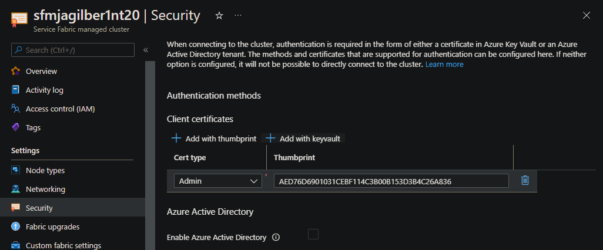
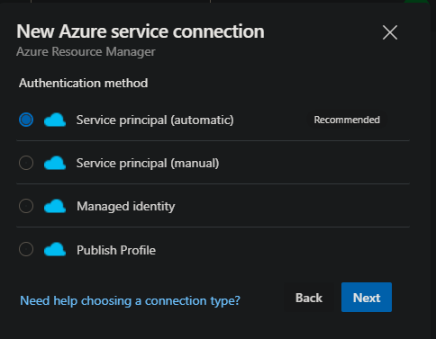

# How to use AzurePowershell builtin task to manage Service Fabric Managed Cluster server thumbprint in Azure Devops service connection

Service Fabric Managed Clusters manage the 'server' certificate rollover before certificate expires.
There is currently no notification when this occurs.
Azure Devops (ADO) connections using X509 Certificate authentication requires the configuration of the server certificate thumbprint.
When the certificate is rolled over, the Service Fabric service connection will fail to connect to cluster causing pipelines  to fail.

The steps below describe how to use a builtin task with provided powershell script to update the server thumbprint when thumbprint has changed.

## Requirements

- location to store powershell script used in task that is available from ADO pipeline: https://aka.ms/sf-managed-ado-connection.ps1
- service fabric managed cluster 'client' certificate has to be stored in azure key vault and be accessible from ADO pipeline / release.
- ADO Azure service connection to subscription with managed cluster.
- service connection in ADO permissions allowing access to update connection from ADO pipeline / release.
- AzurePowershell task executing script must be executed before any Service Fabric task and must be in the same job.

## Process

The provided ADO configurations and powershell script performs the following:

- Builtin task AzurePowershell:
    - provides the connection to Azure for querying managed cluster and key vault resources.
    - downloads and executes powershell script sf-managed-ado-connection.ps1.
- Powershell script does the following:
    1. connects to ADO service endpoint REST url to enumerate service fabric connection.
    2. connects to Azure to query service fabric managed cluster by service connection url.
    3. compares server thumbprint from azure resource and from service connection.
    4. if thumbprint is different:
        1. connects to Azure to query key vault for 'client' certificate to create base64 string for ADO connection.
        2. updates ADO service endpoint via REST with new server thumbprint.
        3. writes ##vso[task.setvariable variable=ENDPOINT_AUTH_$serviceConnectionName;] to update connection thumbprint for subsequent tasks.

## Azure Key vault

To provide ADO with certificate information, the Admin client certificate for the managed service fabric cluster has to be stored in a key vault.
To create the service connection, the base64 string of the PFX certificate is required.
During the creation of cluster, either a thumbprint or key vault is required.
If key vault was provided, the same Admin client certificate can be used for ADO connection.
If the cluster has not been configured to use a key vault, a key vault can be added.

### Add key vault to existing cluster

To add a key vault to an existing managed cluster, navigate to the managed cluster resource in azure portal.
On the 'Security' blade, select 'Add with keyvault'.




## Azure Service Connection

### Creating service connection

Create the Azure Service Connection to provide connectivity to Azure from ADO pipelines.
When service connection is created, an Azure App Registration is also created.
This App registration is needed to set the RBAC permissions on the Azure Keyvault.

**NOTE: You may need to allow popups for authentication prompt.

```https://dev.azure.com/{{organization}}/{{project}}/_settings/adminservices```





## Azure Key vault Permissions

After the Azure Service Connection has been created, the keyvault access policy containing the client certificate needs to modified.
The app registration for the Azure connection is added the the Access Policies.
The app registration name is in the format of: %organization%-%project%-%subscriptionId%.


## Azure Devops Permissions

### Service Connection Permissions

### Oauth token

Oauth token needs to be enabled for access to ADO REST API.

## Poweshell commands

Powershell commands to download and execute script.
Replace "```https://aka.ms/sf-managed-ado-connection.ps1```" with location for sf-managed-ado-connection.ps1 url.

```powershell
write-host "starting inline"
[net.servicePointManager]::Expect100Continue = $true;[net.servicePointManager]::SecurityProtocol = [net.SecurityProtocolType]::Tls12;
invoke-webRequest "https://aka.ms/sf-managed-ado-connection.ps1" -outFile "$pwd/sf-managed-ado-connection.ps1";
./sf-managed-ado-connection.ps1 -accessToken $env:accessToken `
  -sfmcServiceConnectionName $env:sfmcServiceConnectionName `
  -keyVaultName $env:keyVaultName `
  -certificateName $env:certificateName
write-host "finished inline"
```

## Using AzurePowershell builtin task in a build pipeline

### build pipeline yaml example

```yaml
variables:
  System.Debug: true
  azureSubscriptionName: 
  sfmcCertificateName: 
  sfmcKeyVaultName: 
  sfmcServiceConnectionName: 

steps:
  - task: AzurePowerShell@5
    inputs:
      azureSubscription: $(azureSubscriptionName)
      ScriptType: "InlineScript"
      Inline: |
        write-host "starting inline"
        [net.servicePointManager]::Expect100Continue = $true;[net.servicePointManager]::SecurityProtocol = [net.SecurityProtocolType]::Tls12;
        invoke-webRequest "https://aka.ms/sf-managed-ado-connection.ps1" -outFile "$pwd/sf-managed-ado-connection.ps1";
        ./sf-managed-ado-connection.ps1 -accessToken $env:accessToken `
          -sfmcServiceConnectionName $env:sfmcServiceConnectionName `
          -keyVaultName $env:keyVaultName `
          -certificateName $env:certificateName
        write-host "finished inline"
      errorActionPreference: continue
      azurePowerShellVersion: LatestVersion
    env:
      sfmcCertificateName: $(sfmcCertificateName)
      sfmcKeyVaultName: $(sfmcKeyVaultName)
      sfmcServiceConnectionName: $(sfmcServiceConnectionName)
      system_accessToken: $(System.AccessToken)
```

## Using AzurePowershell builtin task in a release pipeline


### release pipeline yaml pseudo example

```yaml
# uses release pipeline variables:
#  sfmcCertificateName
#  sfmcKeyvaultName
#  sfmcServiceConnectionName

steps:
- task: AzurePowerShell@5
  displayName: 'Azure PowerShell script: InlineScript'
  inputs:
    azureSubscription: 
    ScriptType: InlineScript
    Inline: |
     write-host "starting inline"
     [net.servicePointManager]::Expect100Continue = $true;[net.servicePointManager]::SecurityProtocol = [net.SecurityProtocolType]::Tls12;
     invoke-webRequest "https://aka.ms/sf-managed-ado-connection.ps1" -outFile "$pwd/sf-managed-ado-connection.ps1";
     ./sf-managed-ado-connection.ps1 -accessToken $env:accessToken `
        -sfmcServiceConnectionName $env:sfmcServiceConnectionName `
        -keyVaultName $env:keyVaultName `
        -certificateName $env:certificateName
      write-host "finished inline"
    errorActionPreference: continue
    azurePowerShellVersion: LatestVersion
    pwsh: true
```

```json

```

## Troubleshooting

Use logging from task to assist with issues.
Enabling System.Debug in build yaml or in release variables will provide additional write-verbose output from script but will include sensitive security information.

## Example 

```text


```