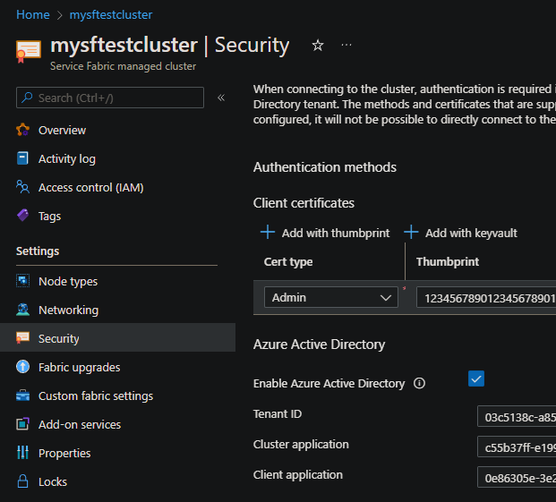
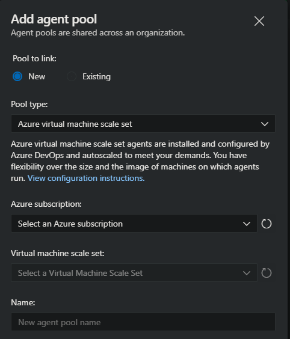
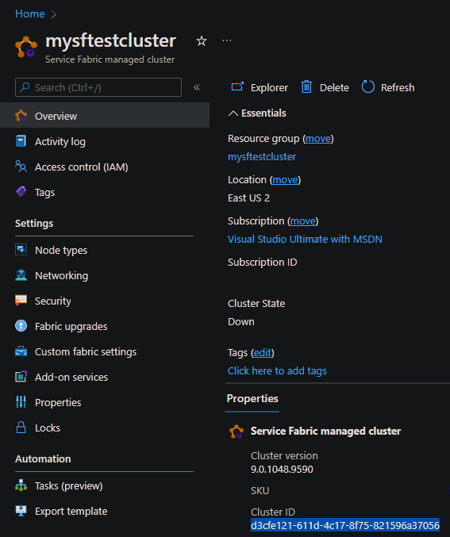

# How to configure Azure Devops Service Fabric Managed Cluster Service Connection


The steps below describe how to configure the ADO service connection for Service Fabric managed clusters with Azure Active Directory (AAD / Azure AD). This solution requires both the use of Azure AD and the use of Azure provided build agents in ADO.

Service Fabric Managed Clusters provision and manage the 'server' certificate including the rollover process before certificate expiration.
There is currently no notification when this occurs.
Azure Devops (ADO) service connections that use X509 Certificate authentication requires the configuration of the server certificate thumbprint.
When the certificate is rolled over, the Service Fabric service connection will fail to connect to cluster causing pipelines to fail.


## Requirements

- Service Fabric managed cluster security with Azure Active Directory enabled. See [Service Fabric cluster security scenarios](https://docs.microsoft.com/azure/service-fabric/service-fabric-cluster-security#client-to-node-azure-active-directory-security-on-azure) for additional information.

  


- Azure Devops user configured to use the 'Cluster' App Registration that is configured for the managed cluster.

- Azure Devops build agent with 'Hosted' (not 'Self-Hosted') pool type. For hosted, 'Azure virtual machine scale set' is the pool type to be used.

  

## Process

- Verify [Requirements](#requirements).
- In Azure Devops, create / modify the 'Service Fabric' service connection to be used with the build / release pipelines for the managed clusteer.
- Test connection.


### Service Fabric Service Connection

Create / Modify the Service Fabric Service Connection to provide connectivity to Service Fabric managed cluster from ADO pipelines.
For maintenance free configuration, only 'Azure Active Directory credential' authentication  and 'Common Name' server certificate lookup is supported.

#### Service Fabric Service Connection Properties
- **Authentication method:** Select 'Azure Active Directory credential'.
- **Cluster Endpoint:** Enter connection endpoint for cluster. This is in the format of tcp://{{cluster name}}.{{azure region}}.cloudapp.azure.com:{{cluster endpoint port}}.
  - Example: tcp://mysftestcluster.eastus.cloudapp.azure.com:19000
- **Server Certificate Lookup (optional):** Select 'Common Name'.
- **Server Common Name** Enter the managed cluster server certificate common name. The common name format is {{cluster guid id with no dashes}}.sfmc.azclient.ms. This name can also be found in the cluster manifest in Service Fabric Explorer (SFX).
  - Example: d3cfe121611d4c178f75821596a37056.sfmc.azclient.ms

    

- **Username:** Enter an Azure AD user that has been added to the managed clusters 'Cluster' App Registration in UPN format. This can be tested by connecting to SFX as the Azure AD user.
- **Password:** Enter Azure AD users password. If this is a new user, ensure account is not prompting for a password change. This can be tested by connecting to SFX as the Azure AD user.
- **Service connection name:** Enter a descriptive name of connection.

  

## Troubleshooting

- Test network connectivity. Add a powershell task to pipeline to run 'test-netconnection' command to cluster endpoint, providing tcp port. Default port is 19000.
  - Example:
  ```yaml
  - powershell: |
    $psversiontable
    $publicIp = (Invoke-RestMethod https://ipinfo.io/json).ip
    write-host "current public ip:$publicIp" -ForegroundColor Green
    [environment]::getenvironmentvariables().getenumerator()|sort Name
    $result = test-netconnection $env:clusterEndpoint -p $env:clusterPort
    write-host "test net connection result: $result"
  errorActionPreference: continue
  displayName: "PowerShell Troubleshooting Script"
  failOnStderr: false
  ignoreLASTEXITCODE: true
  env:  
    clusterPort: 19000
    clusterEndpoint: xxxxxx.xxxxx.cloudapp.azure.com
  ```

- Verify configured Azure AD user is able to logon successfully to cluster using SFX or powershell.
  ```powershell
  $clusterEndpoint = 'mysftestcluster.eastus.cloudapp.azure.com'
  $clusterName = 'mysftestcluster'

  $clusterResource = Get-AzResource -Name $clusterName -ResourceType 'Microsoft.ServiceFabric/managedclusters'
  $serverCertThumbprint = $clusterResource.Properties.clusterCertificateThumbprints

  Connect-ServiceFabricCluster -ConnectionEndpoint $clusterEndpoint `
    -AzureActiveDirectory `
    -ServerCertThumbprint $serverCertThumbprint `
    -Verbose
  ```
- Use logging from task to assist with issues.
- Enabling System.Debug in build yaml or in release variables will provide additional output.

